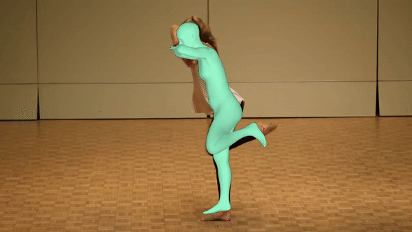

# POCO: Pose and Shape Estimation with Confidence

[Sai Kumar Dwivedi](https://ps.is.mpg.de/person/sdwivedi), [Cordelia Schmid](https://thoth.inrialpes.fr/~schmid/), [Hongwei Yi](https://ps.is.mpg.de/person/hyi), [Michael J. Black](https://ps.is.mpg.de/person/black), [Dimitrios Tzionas](https://dtzionas.com)

[](https://www.youtube.com/watch?v=rrAl90dYvZE)  [](https://arxiv.org/abs/2308.12965)  [](https://poco.is.tue.mpg.de)


<div style="display:flex;">
    
    
</div>


## Setup and Installation

Clone the repository: 
```shell
git clone https://github.com/saidwivedi/POCO.git
```

Create fresh conda environment and install all the dependencies:
```
conda create -n poco python=3.8
conda install pytorch==1.8.0 torchvision==0.9.0 torchaudio==0.8.0 cudatoolkit=11.1 -c pytorch -c conda-forge
pip install -r requirements.txt
```

## Pretrained Models

To run the demo, please download the pretrained models and necessary files from [here](https://keeper.mpdl.mpg.de/f/2a5c9137cb024abc9fd2/?dl=1). After downloading, unzip the file and ensure that the contents are placed in a folder named `./data`.

## Demo

We provide two versions of POCO: POCO-PARE and POCO-CLIFF. Note that POCO-CLIFF is more suitable for in-the-wild scenarios. To run a specific model, make sure to change the `--cfg` and `--ckpt` parameters accordingly i.e `pare` for POCO-CLIFF and `cliff` for POCO-CLIFF.

### Run the demo on a video

```
python demo.py --mode video --vid_file demo_data/friends.mp4 --cfg configs/demo_poco_cliff.yaml --ckpt data/poco_cliff.pt --output_folder out
```

### Run the demo on image folder

```
python demo.py --mode folder --vid_file demo_data/images --cfg configs/demo_poco_cliff.yaml --ckpt data/poco_cliff.pt --output_folder out
```

## Acknowledgements

Parts of the code are taken or adapted from the following repos:
- [PARE](https://github.com/mkocabas/PARE)
- [CLIFF](https://github.com/huawei-noah/noah-research/tree/master/CLIFF)
- [RLE](https://github.com/Jeff-sjtu/res-loglikelihood-regression)
- [BEDLAM](https://github.com/pixelite1201/BEDLAM)
- [RealNVP](https://github.com/senya-ashukha/real-nvp-pytorch/)

We thank Partha Ghosh and Haiwen Feng for insightful discussions, Priyanka Patel for the CLIFF implementation, and Peter Kulits, Shashank Tripathi, Muhammed Kocabas, and the Perceiving Systems department for their feedback. SKD acknowledges support from the International Max Planck Research School for Intelligent Systems (IMPRS-IS). This work was partially supported by the German Federal Ministry of Education and Research (BMBF): Tubingen AI Center, FKZ: 01IS18039B.

## Citing
If you find this code useful for your research, please consider citing the following paper:

```bibtex
@inproceedings{dwivedi_3dv2023_poco,
    title={{POCO}: {3D} Pose and Shape Estimation using Confidence},
    author={Dwivedi, Sai Kumar and Schmid, Cordelia and Yi, Hongwei and Black, Michael J. and Tzionas, Dimitrios},
    booktitle={International Conference on 3D Vision (3DV)},
    year={2024},
}
```

## License

This code is available for **non-commercial scientific research purposes** as defined in the [LICENSE file](LICENSE). By downloading and using this code you agree to the terms in the [LICENSE](LICENSE). Third-party datasets and software are subject to their respective licenses.

## Contact

For code related questions, please contact sai.dwivedi@tuebingen.mpg.de

For commercial licensing (and all related questions for business applications), please contact ps-licensing@tue.mpg.de.